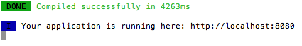
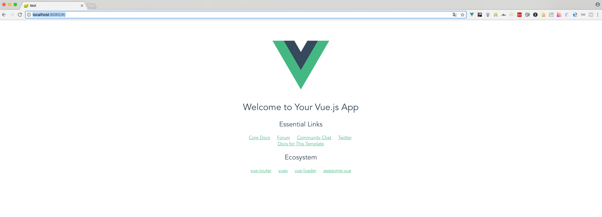

# Vue.js
사용자 인터페이스 빌드를 위한 오픈 소스 프로그레시브 자바스크립트 프레임워크입니다.<br>
뷰를 사용하여 다른 자바스크립트 라이브러리를 사용하는 프로젝트에 통합하는 일은 쉬운데 그 이유는 점진적으로 채택할 수 있게 설계되어 있기 때문입니다. <br>
또, Vue는 고급 싱글 페이지 애플리케이션을 지원하는 웹 애플리케이션 프레임워크의 역할을 할 수도 있습니다.

## Vue.js 설치
설치에 대한 가이드는 https://kr.vuejs.org 에서 자세하게 확인이 가능합니다. 
Vue.js는 단일 페이지 응용 프로그램을 빠르게 스캐폴딩하기 위한 공식 CLI를 제공하고 현대적인 프론트엔드 워크플로우를 위해 잘 구성된 빌드 설정을 제공합니다.

1. CDN <br>
https://unpkg.com/vue 주소를 script 태그에 직접 추가 
2. Vue.js 파일다운 <br>
[개발용](https://kr.vuejs.org/js/vue.js), [배포용](https://kr.vuejs.org/js/vue.min.js) 버전을 다운 받아 script 태그에 추가
개발용 버전은 개발에 도움이 되는 모든 경고를 출력하기 때문에 개발 중에만 사용하고, 실제 서비스에서는 배포용 버전으로 사용해야 한다.
3. NPM 설치

## npm 설치
npm이란 Node Package Modules의 약자로, Node.js에서 사용가능한 모듈들을 패키지화시켜 모아놓은 것 입니다. 
npm 설치의 방법은 homebrew를 통해 설치하는 방법과 node.js 홈페이지에서 다운로드받는 방법이 있습니다.
1. homebrew를 통한 설치 : 터미널을 열고 명령어 brew install node 실행
2. node.js 홈페이지에서 다운로드 설치 : https://nodejs.org 에서 다운로드 가능

설치 후 확인하는 법은 터미널에서 아래와 같이 확인이 가능합니다.<br>
```
node -v
# v6.11.0

npm -v
# 3.10.10
```

## vue-cli 설치
vue-cli를 사용하면 뷰 애플리케이션을 개발하기 위한 초기 프로젝트 구조를 쉽게 구성할 수 있습니다. <br>
다만, 싱글 파일 컴포넌트 체계를 사용하려면 .vue 파일을 웹 브라우저가 인식할 수 있는 형태의 파일로 변환해 주는 웹팩(Webpack)이나 브라우저리파이(Browserify)와 같은 도구가 필요합니다. 

아래 명령어를 입력하면 설치가 진행되고 Vue CLI가 시스템 레벨에 설치됩니다
```
# vue-cli 전역 설치, 권한 에러시 sudo 추가
$ npm install vue-cli --global
```

시스템 레벨에 설치 되었다는 말은 vue를 입력하면 다음과 같이 인식한다는 것을 의미합니다

```
$ vue

  Usage: vue <command> [options]

  Options:

    -V, --version  output the version number
    -h, --help     output usage information

  Commands:

    init           generate a new project from a template
    list           list available official templates
    build          prototype a new project
    create         (for v3 warning only)
    help [cmd]     display help for [cmd]

```

### 1. vue-cli 설치 명령어
| 템플릿 종류                   | 설명 |
|----------------------------|-----|
| vue init webpack           | 고급 웹팩 기능을 활용한 프로젝트 구성 방식. 테스팅，문법 검사 등을 지원 |
| vue init webpack-simple    | 웹팩 최소 기능을 활용한 프로젝트 구성 방식. 빠른 화면 프로토타이핑용 |
| vue init browserify        | 고급 브라우저리파이 기능을 활용한 프로젝트 구성 방식. 테스팅，문법 검사 등을 지원 |
| vue init browserify-simple | 브라우저리파이 최소 기능을 활용한 프로젝트 구성 방식. 빠른 화면 프로토타이핑용 |
| vue init simple            | 최소 뷰 기능만 들어간 HTML 파일 1개 생성 |
| vue init pwa               | 웹팩 기반의 프로그레시브 웹 앱(PWA, Progressive Web App) 기능을 지원하는 뷰 프로젝트 |

### 2. vue init webpack 실행
```
# 해당 프로젝트 폴더에서 실행
$ vue init webpack

# 현재 디렉토리에서 프로젝트 생성 여부
? Generate project in current directory? (Y/n)

# 프로젝트 이름
? Project name (vue_ex)

# 프로젝트 설명
? Project description (A Vue.js project)

# 프로젝트 작성자
? Author (곽정섭 <kwakjs@brandi.co.kr>)

# 빌드 방식
? Vue build (Use arrow keys)

# vue-router를 설치 여부
? Install vue-router? (Y/n)

# 코드를 보완하기 위해 ESLint를 사용 여부
? Use ESLint to lint your code? (Y/n)

# ESLint 사전 설정 선택
? Pick an ESLint preset (Use arrow keys)

# 단위 테스트 섧정
? Set up unit tests (Y/n)

# 테스트 러너 선택
? Pick a test runner (Use arrow keys)

# Nightwatch로 e2e 테스트를 설정 여부
? Setup e2e tests with Nightwatch? (Y/n)

# 프로젝트가 생성 된 후에`npm install`을 실행해야합니까?
? Should we run `npm install` for you after the project has been created? (recommended) (Use arrow keys)
```

### 3. 설치완료
```
Running eslint --fix to comply with chosen preset rules...
# ========================


> test@1.0.0 lint /Users/Shamdori/Documents/dori-git/vuejs/test
> eslint --ext .js,.vue src "--fix"


# Project initialization finished!
# ========================

To get started:

  npm run dev
  
Documentation can be found at https://vuejs-templates.github.io/webpack
```

### 4. package.json 파일에 설정된 라이브러리 설치
```
$ npm install
```

### 5. 실행
```
$ npm run dev
```


### 6. 브라우저 실행
```
http://localhos:8080/
```



## 참고
- 설치방법 : [https://kr.vuejs.org/v2/guide/installation.html](https://kr.vuejs.org/v2/guide/installation.html)
- Vue.js : [https://kr.vuejs.org](https://kr.vuejs.org)
- vue-router : [https://router.vuejs.org/kr](https://router.vuejs.org/kr)
- vuex : [https://vuex.vuejs.org/kr](https://vuex.vuejs.org/kr)
- vue-loader : [https://vue-loader.vuejs.org/kr](https://vue-loader.vuejs.org/kr)