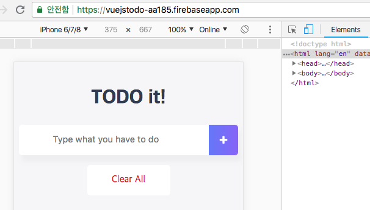

# 할 일 관리 앱 만들기

> 할 일 관리 앱은 적은 코드 양으로 뷰 애플리케이션을 제작할 때 반드시 알아야 할 컴포넌트 구조화와 컴포넌트 통신을 구현해 볼 수 있습니다.
이 앱을 뷰로 직접 만들어 보면서 뷰에 대한 감각을 더 익혀 봅시다.

라고 책에 써 있습니다. 만들어 보면서 애플리케이션 구조화 방법 및 제작 방법을 배워 봅시다.

## 앱 살펴보기
> Demo: [https://vuejstodo-aa185.firebaseapp.com/](https://vuejstodo-aa185.firebaseapp.com/)

크롬 브라우저에서 개발자 도구 실행 후 Toggle device toolbar를 클릭 후 화면을 보면 모바일에 최적화 된 앱을 확인 할 수 있습니다.<br>


이 어플리케이션은 4개의 컴포넌트(header, input list, footer)로 쪼개 놓았습니다.<br>
이는 재사용성을 높이고, 각 컴포넌트 간에 자유롭게 데이터를 전달 함으로 반응성 좋은 애플리케이션을 제작하기 위함입니다.

## 프로젝트 생성하고 구조 확인하기
### 뷰 CLI를 이용한 프로젝트 생성
프로젝트 초기 구성을 위해 뷰 CLI로 프로젝트를 생성합니다.<br>
vue.js 설치 관련 해서는 링크를 통해 확인 할 수 있습니다.

링크 : [https://github.com/Shamdori/vuejs](https://github.com/Shamdori/vuejs)

### 프로젝트 초기 설정
index.html 파일의 \<head>에 아래와 같이 설정을 합니다.<br>
필수 설정은 아니니 상황에 맞게 설정하시면 됩니다.

- 반응형 웹 디자인 태그 설정
  ```
  <head>
    <meta charset="utf-8">
    <meta name="viewport" contennt="width=device-width, initial-scale=1.0">
    <title>Vue.js Todo</title>
  </head>
  ```
- Awesome 아이콘 CSS 설정
  ```
  <head>
    <meta charset="utf-8">
    <meta name="viewport" contennt="width=device-width, initial-scale=1.0">
    <title>Vue.js Todo</title>
    <link rel="stylesheet" href="https://maxcdn.bootstrapcdn.com/font-awesome/4.7.0/css/font-awesome.min.css">
  </head>
  ```
- 폰트와 파비콘 설정
  ```
  <head>
    <meta charset="utf-8">
    <meta name="viewport" contennt="width=device-width, initial-scale=1.0">
    <title>Vue.js Todo</title>
    <link rel="stylesheet" href="https://maxcdn.bootstrapcdn.com/font-awesome/4.7.0/css/font-awesome.min.css">
    <link rel="shortcut icon" href="src/assets/favicon.ico" type="image/x-icon">
    <link rel="icon" href="src/assets/favicon.ico" type="image/x-icon">
    <link href="https://fonts.googleapis.com/css?family=Ubuntu" rel="stylesheet">
  </head>
  ```

## 컴포넌트 생성하고 등록하기
> 애플리케이션 구동에 필요한 컴포넌트들(header, input list, footer)을 생성하고 등록합니다.<br>
컴포넌트의 경우 관례상 src/components 폴더에서 관리를 합니다.<br>
큐모가 커서 기능별로 관리를 해야 할 경우는 src/components/기능/컴포넌트.vue와 같은 형식으로 관리하는게 좋습니다.

### 컴포넌트 생성
- src 폴더 하위에 components 폴더 생성합니다.
- components 하위에 TodoHeader.vue, TodoInput.vue, TodoList.vue, TodoFooter.vue 파일을 생성합니다.

### 컴포넌트 등록
- 지역 컴포넌트 등록 형식
  ```
  components: {
    '컴포넌트 이름': 컴포넌트 내용
  }
  ```
- 컴포넌트 내용을 불러오기 위한 ES6 import 구문
  ```
  import 불러온 파일의 내용이 담길 객체 from '불러올 파일 위치';
  ```
- 컴포넌트 추가
  ```
  <template>
    <div id="app">
      <TodoHeader></TodoHeader>
      <TodoInput></TodoInput>
      <TodoList></TodoList>
      <TodoFooter></TodoFooter>
    </div>
  </template>
  ```

## 컴포넌트 내용 구현하기

## 기존 애플리케이션 구조의 문제점 해결하기더 나은 사용자 경험을 위한 기능 추가하기
